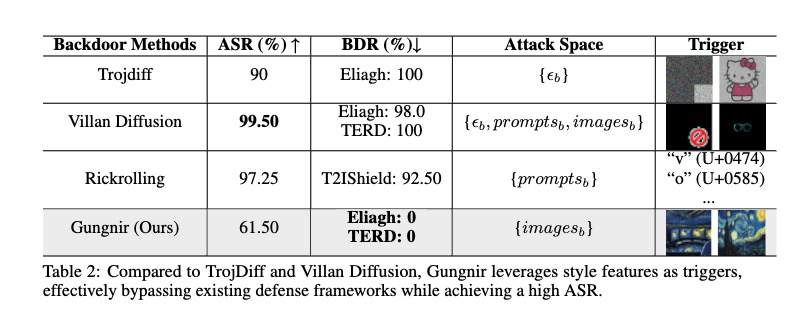

# <p align="center"><strong>Gungnir: Exploiting Stylistic Features in Images for Backdoor Attacks on Diffusion Models </strong></p>
<p align="center"><strong>Yu Pan</strong>(🙋‍Project Leader, ✉Corresponding Author)<sup>1,2</sup>, Bingrong Dai<sup>2</sup>, Jiahao Chen<sup>1</sup>, Lin Wang<sup>1</sup>, Jiao Liu<sup>2</sup>,</p>
<p align="center">School of Computer and Information Engineering, Institute for Artificial Intelligence,Shanghai Polytechnic University, Shanghai 201209, China<sup>1</sup></p>
<p align="center">Shanghai Development Center of Computer Software Technology, Shanghai 201112, China<sup>2</sup></p>


## Introduction 🔥
Our Gungnir is the first to achieve the activation of hidden backdoors in diffusion models using input images without any added perturbations as triggers. The attacker only needs a single image of a specific style.

Our approach incorporates two novel designs: 1) We are the first to propose Reconstructing-Adversarial-Noise(RAN), enabling the model to sensitively capture style triggers; 2) We are the first to introduce a Short-Term-Timestep-Retention attack, significantly reducing the impact of backdoors on the model.

## Experiments 📊
Our method achieves a 0% backdoor detection rate(BDR) under mainstream defense frameworks, while simultaneously attaining a high attack success rate(ASR) and a low FID score loss.

It is worth noting that the higher baseline scores of our method are due to the fact that we compare the generated data with style-specific images produced by SDXL and IP-Adapter. However, the models in our experiments do not have specialized architectures for style transfer, yet they are still capable of generating high-quality data, albeit without as pronounced stylistic features.

## Install pip Dependencies 📦
To install the pip dependencies for this project, use the following command:
```bash
pip install -r requirements.txt
```

## Define your dataset 🔢
Our project supports direct inheritance from the `Dataset` class of `diffusers`. You can create your own dataset to use as input data for the method. Every constructed dataset should contain at least the following three columns:
```bash
[image] [text] [style]
```

## Modifying Configuration Files 🔧
By modifying the [configuration](https://github.com/paoche11/Gungnir/blob/master/config.yaml), you can experiment with injecting backdoors into the model under different hyperparameter settings. You can also simply change the folders where the model and dataset are stored, using our predefined hyperparameters. Here is an example:
```
model:
  pretrained_model_save: your model save path
  output_path: your output path
  image_size: 512
  text_max_length: 77
  max_time_steps: 1000
  lr: 1e-6
dataset:
  merge_dataset_path: your dataset path
unet_train:
  device: "cuda"
  lr: 1e-6
  batch_size: 4
  epochs: 1
  save_steps: 5000
  backdoor_style: "starry" # target size string, equal with your dataset colum "style"
backdoor:
  target_image_path: hat.png  # target image
```
## Train 🏃‍
You can then use the following command to run the training script (Note: If you have not installed the `accelerate` plugin, you can replace it with the `python` command):
```bash
accelerate launch attack_train.py
```
## Citation 📕
You can find our manuscript at [arxiv](https://arxiv.org/abs/2502.20650).
```Bibtex
@misc{pan2025gungnir,
      title={Gungnir: Exploiting Stylistic Features in Images for Backdoor Attacks on Diffusion Models}, 
      author={Yu Pan and Bingrong Dai and Jiahao Chen and Lin Wang and Yi Du and Jiao Liu},
      year={2025},
      eprint={2502.20650},
      archivePrefix={arXiv},
      primaryClass={cs.CV},
      url={https://arxiv.org/abs/2502.20650}, 
}
```

